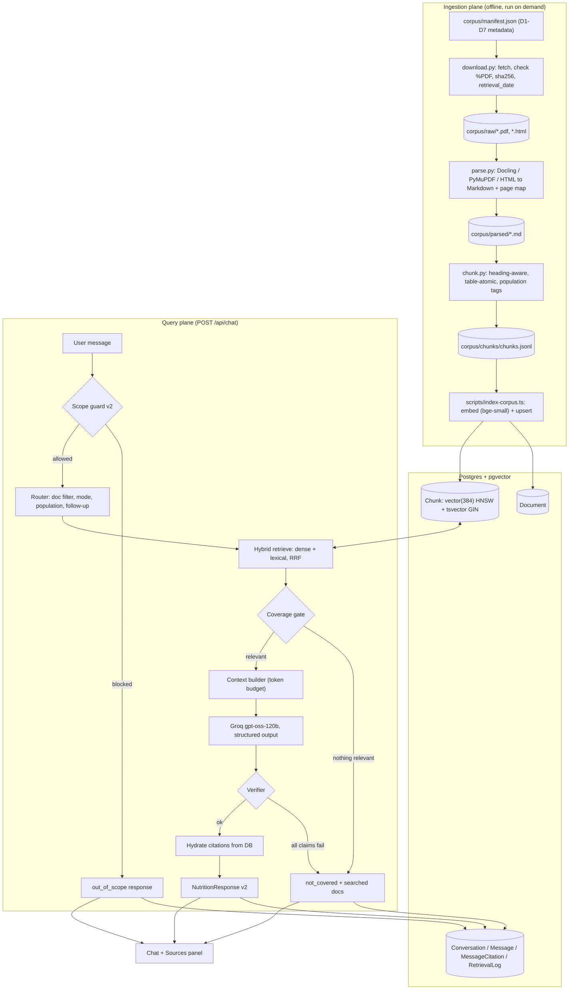
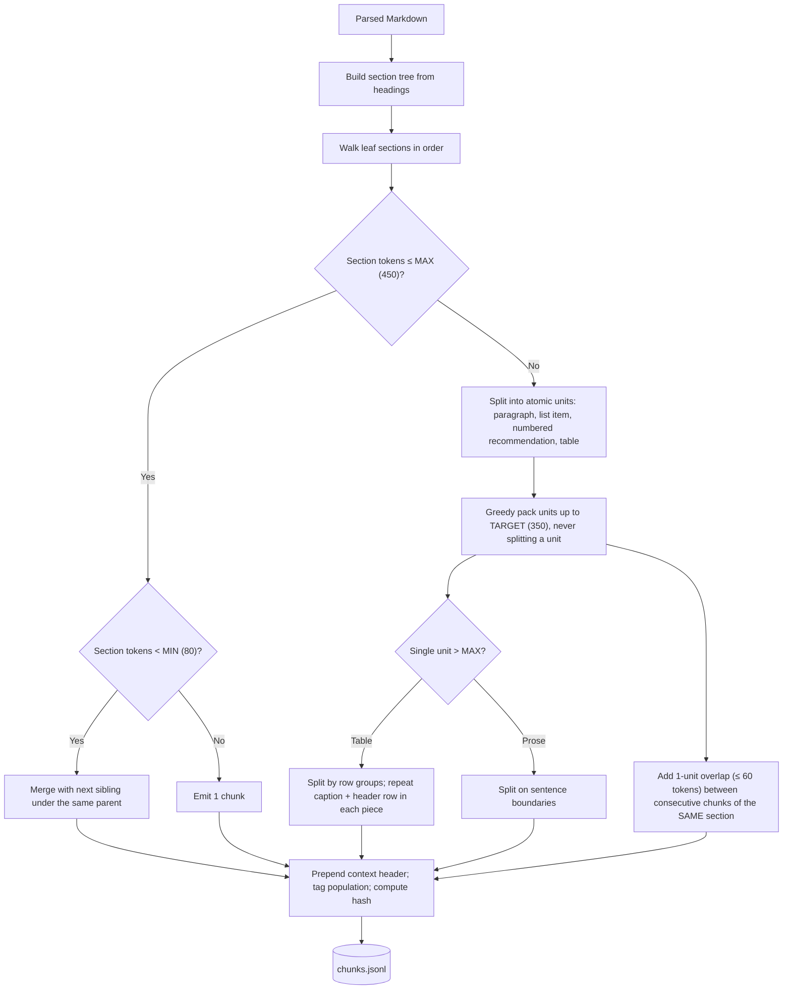
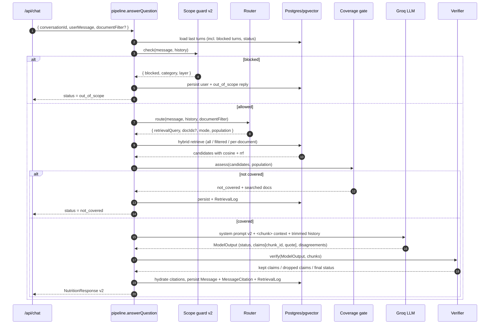
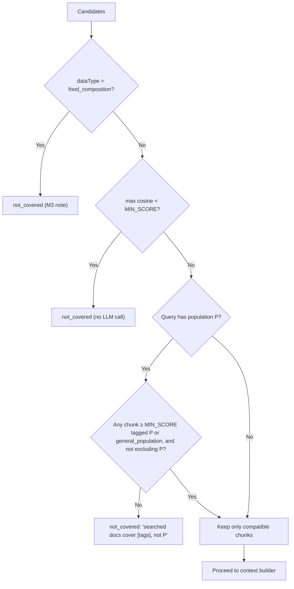

# Dietary Guidance RAG Chatbot — Milestone 2 Feature Architecture

> **Implements:** [`featureStatement.md`](./featureStatement.md)
> **Extends:** [`Docs (M1)/architecture.md`](../Docs%20(M1)/architecture.md). Same frontend, same endpoint, same response shape, now with real sources
> **Status:** Design, ready for implementation
> **Runtime constraint that shapes everything:** Groq `openai/gpt-oss-120b` with an **8K tokens-per-minute** limit (see [`app/api/chat/route.ts`](../app/api/chat/route.ts))

---

## Table of Contents

1. [Goals, Guarantees and Non-Goals](#1-goals-guarantees-and-non-goals)
2. [System Overview](#2-system-overview)
3. [Key Design Decisions](#3-key-design-decisions)
4. [Tech Stack Additions](#4-tech-stack-additions)
5. [Repository Structure (New and Changed)](#5-repository-structure-new-and-changed)
6. [Corpus Layer](#6-corpus-layer)
7. [Parsing](#7-parsing)
8. [Chunking](#8-chunking)
9. [Embedding and Indexing](#9-embedding-and-indexing)
10. [Query-Time Pipeline](#10-query-time-pipeline)
11. [Response Schema v2](#11-response-schema-v2)
12. [Refusal Design](#12-refusal-design)
13. [Cross-Document Answers](#13-cross-document-answers)
14. [Persistence (Prisma Changes)](#14-persistence-prisma-changes)
15. [API Contract](#15-api-contract)
16. [Frontend Changes](#16-frontend-changes)
17. [Configuration](#17-configuration)
18. [Evaluation Harness](#18-evaluation-harness)
19. [Observability](#19-observability)
20. [Deployment](#20-deployment)
21. [Risks and Mitigations](#21-risks-and-mitigations)
22. [Implementation Plan](#22-implementation-plan)
23. [Requirement Traceability](#23-requirement-traceability)
24. [README Content Checklist](#24-readme-content-checklist)
25. [Open Decisions](#25-open-decisions)

---

## 1. Goals, Guarantees and Non-Goals

### 1.1 Guarantees and How Each Is Enforced

Each guarantee is enforced **in code** where possible. The system prompt is backup only.

| Guarantee | Prompt-level | Code-level enforcement |
|:----------|:-------------|:-----------------------|
| **Grounded** | "Answer only from `<chunk>` blocks" | Coverage gate before generation. Verifier after generation: quote-substring check and numeric grounding check (§10.7) |
| **Cited** | "Every claim cites one `chunk_id`" | Zod schema requires a `chunk_id` per claim. Server fills in publisher, year and URL from the DB, so the model never writes them (§10.8) |
| **Honest about gaps** | "Return `not_covered` if the chunks don't answer it" | Score threshold blocks the LLM call when nothing relevant is retrieved. If the verifier drops every claim, the answer becomes `not_covered` (§10.4) |
| **Out of scope declined** | Kept from M1 | Layered scope guard on input, a multi-turn sticky check, and an output guard (§10.1) |
| **No blending** | "One claim = one document" | Each claim cites exactly one chunk. The verifier rejects claims that cite chunks from more than one document (§13) |
| **Population-level only** | "Don't turn guidance into personal advice" | Output check for second-person prescriptions. Population tags on chunks block near-miss answers (§10.2, §10.7) |

### 1.2 Non-Goals

- **Nutrient values for individual foods** (for example, "protein in 100 g lentils"). These come from the Milestone 3 structured database. The router detects them and returns `not_covered` with a note.
- Rebuilding the frontend or backend. M2 **extends** [`ChatWindow`](../components/ChatWindow.tsx), [`SourcesPanel`](../components/SourcesPanel.tsx), [`/api/chat`](../app/api/chat/route.ts) and [`lib/`](../lib).
- Fine-tuning, re-ranking models, or any paid vector database.

---

## 2. System Overview

The system has two planes. The **ingestion plane** runs offline (locally or in CI) and writes into Postgres. The **query plane** runs per request inside the existing Next.js API route.



**Unchanged from M1:** server-side model calls only, Zod validation as a hard contract, the scope guard runs before any model call, and the chat UI layout stays the same.

---

## 3. Key Design Decisions

| # | Decision | Chosen | Alternatives considered | Why |
|:--|:---------|:-------|:------------------------|:----|
| ADR-1 | Vector store | **Postgres + pgvector** (same DB as conversations) | Pinecone, Qdrant | Postgres is already in production. One database, one connection string, transactional joins between `Chunk` and `MessageCitation`, and no new vendor |
| ADR-2 | Embedding model | **`BAAI/bge-small-en-v1.5`** (384-dim, local, free) via Transformers.js | OpenAI `text-embedding-3-small`, Cohere | The project has only a Groq key, and Groq has no embeddings endpoint. A local model needs no new key and gives the same output for the same input. Hidden behind an `Embedder` interface so it can be swapped (§9.1) |
| ADR-3 | Where embeddings are computed | **Node (Transformers.js) for both indexing and querying** | Python sentence-transformers for indexing, Node for querying | Using the same runtime and the same ONNX weights means document vectors and query vectors always come from the identical model. No parity drift |
| ADR-4 | Parsing and chunking language | **Python** (`ingest/`) | Node PDF libraries | Docling and PyMuPDF are much better at headings and tables, which §5.2 requires. Output is plain JSONL, so the Node app never depends on Python at runtime |
| ADR-5 | Chunking strategy | **Heading-aware, table-atomic, recommendation-atomic**, with a size cap | Fixed-size, semantic splitting | Required by the brief. Keeps every number together with what it applies to |
| ADR-6 | Retrieval | **Hybrid**: dense cosine + Postgres full-text, fused with Reciprocal Rank Fusion | Dense only | Guidance text is full of exact terms (`TPC`, `B12`, `Section 59`, `6 g`) that dense embeddings match poorly. Full-text search in Postgres costs nothing extra |
| ADR-7 | Who writes citation metadata | **The server.** The LLM outputs only `chunk_id` and a verbatim `quote` | The LLM writes the full citation | Removes made-up attributions (an M1 failure mode). Publisher, year and URL always come from `Document` rows |
| ADR-8 | "Do the chunks answer it?" | **Three stages:** score threshold, LLM `status`, verifier | LLM judgement only | The threshold saves TPM on obvious misses. The verifier catches answers that sound confident but aren't supported |
| ADR-9 | Scope guard hardening | Regex + **embedding-similarity classifier** + conversation-aware sticky check + output guard | An extra LLM classifier call | An extra LLM call would roughly double TPM use. The embedding classifier reuses the already-loaded model at zero API cost |
| ADR-10 | Orchestration | **Plain TypeScript modules** in `lib/rag/` | LangChain | Every step can be seen and tested. The pipeline is short enough not to need a framework |
| ADR-11 | Schema migrations | **`prisma migrate deploy`** with SQL migrations | `prisma db push --accept-data-loss` (current `start` script) | `db push` can drop raw-SQL objects it doesn't model (HNSW index, `tsvector` column). This must change before deploying M2 (§20) |

---

## 4. Tech Stack Additions

| Area | Addition | Notes |
|:-----|:---------|:------|
| Ingestion runtime | Python 3.11+ (`ingest/requirements.txt`) | Offline only, never deployed |
| PDF parsing | `docling` (primary), `pymupdf4llm` (fallback) | Docling handles table structure. PyMuPDF is fast for simple text PDFs |
| HTML parsing | `beautifulsoup4` + `markdownify` | For D3 (GOV.UK HTML) |
| Tokenizer (chunk sizing) | `transformers` `AutoTokenizer("BAAI/bge-small-en-v1.5")` | Chunk sizes are measured in **embedding-model tokens**, because the model truncates at 512 |
| Embeddings (Node) | `@huggingface/transformers` (v3) | `feature-extraction`, CLS pooling, normalised, `dtype: 'q8'` |
| Vector search | `pgvector` ≥ 0.8 extension | HNSW index, cosine ops, iterative scan for filtered queries |
| DB access for vectors | `prisma.$queryRaw` | Prisma has no native `vector` type, so it's declared as `Unsupported("vector(384)")` |
| Token budgeting (Node) | `js-tiktoken` (`o200k_base`) | Approximates gpt-oss token counts for the context budget |
| Evaluation scripts | `tsx` (dev dependency) | Runs `scripts/*.ts` directly |

No change to Next.js 15, React, Tailwind, Zod, the OpenAI SDK (pointed at Groq), or Prisma.

---

## 5. Repository Structure (New and Changed)

```
ai-nutrition/
├── corpus/                              # NEW: source of truth for documents
│   ├── manifest.json                    # D1–D7 metadata (§6.1)
│   ├── annotations/D1.yaml …            # Optional per-doc overrides: heading rules, population tags, excluded pages
│   ├── raw/                             # Downloaded PDFs/HTML (git-ignored; sha256 recorded in manifest)
│   ├── parsed/D1.md …                   # Parser output (committed, so chunking can be reviewed in diffs)
│   └── chunks/chunks.jsonl              # Chunker output (committed)
│
├── ingest/                              # NEW: Python, offline
│   ├── requirements.txt
│   ├── download.py                      # Fetch + validate + checksum + retrieval_date
│   ├── parse.py                         # PDF/HTML → Markdown with page markers
│   ├── chunk.py                         # Heading-aware chunker
│   ├── population.py                    # Population tagging rules
│   └── report.py                        # Chunk stats (size histogram, tables, orphans) → corpus/chunks/report.md
│
├── scripts/                             # NEW: Node/TS, run with tsx
│   ├── index-corpus.ts                  # Embed chunks.jsonl → upsert Document + Chunk
│   ├── label-question-bank.ts           # Helper: search chunks to pin expected chunk_ids
│   ├── eval-retrieval.ts                # Hit@k / MRR on the question bank (no LLM)
│   ├── eval-answers.ts                  # Full pipeline on the question bank, records failure source
│   ├── eval-adversarial.ts              # Multi-turn break-it scripts
│   ├── eval-citations.ts                # 10-answer citation spot-check sheet
│   └── run-m1-regression.ts             # 10 M1 questions → failure-log/results-m2.md
│
├── eval/                                # NEW
│   ├── question-bank.json               # ≥15 questions with expected doc/section/chunk
│   ├── adversarial.json                 # Multi-turn break-it conversations
│   ├── scope-exemplars.json             # In-scope / out-of-scope exemplars for the classifier
│   └── results/                         # Dated Markdown reports
│
├── lib/
│   ├── schema.ts                        # CHANGED: v2 schemas (§11)
│   ├── systemPrompt.ts                  # CHANGED: v2 grounded prompt (§10.6)
│   ├── model.ts                         # CHANGED: accepts context, temperature 0, returns ModelOutput
│   ├── scopeGuard.ts                    # CHANGED: thin facade over lib/scope/*
│   ├── db.ts                            # unchanged
│   ├── pipeline.ts                      # NEW: answerQuestion() orchestrator
│   ├── scope/
│   │   ├── normalize.ts                 # Text normalisation (NFKC, leetspeak, abbreviations)
│   │   ├── patterns.ts                  # Categorised regex rules
│   │   ├── classifier.ts                # Embedding kNN against exemplars
│   │   ├── conversation.ts              # Sticky multi-turn check
│   │   ├── outputGuard.ts               # Post-generation check
│   │   └── templates.ts                 # Decline messages per category
│   └── rag/
│       ├── config.ts                    # All RAG parameters in one place (§17.2)
│       ├── embedder.ts                  # Embedder interface + local bge implementation
│       ├── router.ts                    # Doc aliases, mode, population, follow-up rewrite
│       ├── retrieve.ts                  # Hybrid SQL + RRF + per-document retrieval
│       ├── coverage.ts                  # Coverage gate
│       ├── context.ts                   # Context block builder + token budget
│       ├── verify.ts                    # Citation / numeric / blend / personalisation checks
│       ├── hydrate.ts                   # chunk_id → full Citation
│       └── documents.ts                 # Cached Document metadata + alias map
│
├── app/api/
│   ├── chat/route.ts                    # CHANGED: delegates to pipeline.answerQuestion()
│   ├── conversations/route.ts           # unchanged
│   ├── documents/route.ts               # NEW: GET corpus list
│   └── chunks/[chunkId]/route.ts        # NEW: GET single chunk (full text for the Sources panel)
│
├── components/
│   ├── ChatWindow.tsx                   # CHANGED: keeps the full v2 response per message
│   ├── MessageBubble.tsx                # CHANGED: status variants, per-document groups, disagreement callout
│   ├── ClaimBadge.tsx                   # CHANGED: citation chip (publisher · year)
│   ├── SourcesPanel.tsx                 # CHANGED: real chunks replace the mock
│   ├── SourceChunkCard.tsx              # NEW
│   ├── DisagreementCallout.tsx          # NEW
│   └── RefusalCard.tsx                  # NEW: not_covered / out_of_scope variants
│
├── prisma/
│   ├── schema.prisma                    # CHANGED (§14)
│   └── migrations/                      # NEW: SQL migrations incl. pgvector + indexes
│
└── failure-log/
    └── results-m2.md                    # NEW: before/after vs results-m1.md
```

---

## 6. Corpus Layer

### 6.1 Manifest (`corpus/manifest.json`)

The manifest is the **only** place document metadata is written by hand. Everything downstream (chunks, DB rows, citations) reads from it.

```json
{
  "version": 1,
  "documents": [
    {
      "doc_id": "D1",
      "title": "Dietary Guidelines for Indians (DGI 2024)",
      "short_name": "DGI 2024",
      "publisher": "ICMR – National Institute of Nutrition (India)",
      "publisher_short": "ICMR-NIN",
      "aliases": ["icmr", "nin", "national institute of nutrition", "indian guidelines", "dgi"],
      "authority_type": "national_nutrition_institute",
      "legal_status": "guidance",
      "year": 2024,
      "source_url": "https://nin.res.in/dietaryguidelines/pdfjs/locale/DGI_2024.pdf",
      "format": "pdf",
      "parser": "docling",
      "retrieval_date": null,
      "sha256": null,
      "exclude_pages": [],
      "default_population": ["general_population"],
      "excluded_population": []
    }
  ]
}
```

| Doc | `publisher_short` | `aliases` (router) | `legal_status` | `parser` | Population notes |
|:----|:------------------|:-------------------|:---------------|:---------|:-----------------|
| D1 | ICMR-NIN | icmr, nin, indian guidelines, dgi | guidance | docling | Section-level tags (infants, children, pregnancy, elderly) |
| D2 | Health Canada | health canada, canada, canadian guidelines | guidance | docling | `default_population: ["age_2_plus"]` |
| D3 | FSA | fsa, food standards agency, uk | guidance | html | Vitamin D advice differs by age group, tagged per section |
| D4 | FSSAI | fssai, ruco, used cooking oil | `guidance_no_force_of_law` | pymupdf | Food business operators |
| D5 | WHO | who, world health organization | guidance | docling | `excluded_population: ["pre_existing_diabetes"]` |
| D6 | WHO | who, five keys | guidance | docling | General population / food handlers |
| D7 | Govt. of India (FSSAI) | fss act, food safety act, fssai | `legislation` | pymupdf | Food business operators (legal) |

`legal_status` is shown in the UI and passed to the model, so D4 is never described as regulation and D7 is never described as consumer advice.

### 6.2 Acquisition (`ingest/download.py`)

1. For each manifest entry, download with a `requests.Session()` so **cookies persist**. This handles the D2 GC Publications page that appears before the PDF.
2. **Validate:**
   - PDF: the file must start with `%PDF`. If it doesn't, follow the "Continue to publication" link once, then fail loudly.
   - HTML (D3): save a **dated snapshot** to `corpus/raw/D3-YYYY-MM-DD.html`.
3. Compute `sha256` and set `retrieval_date` to today's date. Write both back into `manifest.json`.
4. If a stored `sha256` no longer matches a new download, stop and print a diff warning. The document changed upstream, so the question-bank labels must be re-checked.

> [!NOTE]
> `corpus/raw/` is git-ignored because of size (D1 is 24.5 MB). Reproducibility comes from the URL, `sha256` and `retrieval_date` in the manifest.

---

## 7. Parsing

### 7.1 Output Contract

Every parser produces one Markdown file per document with:

- ATX headings (`#`, `##`, `###`) that keep the document's real hierarchy.
- **Tables as Markdown tables** (Docling `export_to_markdown()`).
- Page markers `<!-- page: N -->` inserted at every page break, so chunks can carry `page_start` / `page_end`.
- Running headers and footers, page numbers, the table of contents, references, acknowledgements and the index **removed**. This uses `exclude_pages` from the manifest plus repeated-line detection.

### 7.2 Per-Document Heading Rules

PDF heading detection based on font size is unreliable, so `chunk.py` applies **regex heading promoters** from `corpus/annotations/Dn.yaml`:

| Doc | Structural unit | Example promoter rule |
|:----|:----------------|:----------------------|
| D1 | Guideline N, then sub-sections | `^Guideline\s+\d+` → H1 |
| D2 | Guideline 1/2/3, Considerations | `^Guideline\s+\d` → H1; `^Considerations` → H2 |
| D3 | HTML `h2`/`h3` (already clean) | none |
| D4 | Numbered paragraphs | `^\d+\.\s+[A-Z]` → H2 |
| D5 | Recommendation, Remarks, Rationale | `^Recommendation\s*\d*` → H2 |
| D6 | "Key 1 … Key 5" | `^Key\s+[1-5]` → H1 |
| D7 | Chapter, Section | `^CHAPTER\s+[IVXL]+` → H1; `^\d+\.\s` inside a chapter → H2 |

### 7.3 Manual Review Gate

After parsing, `report.py` lists the headings it detected for each document. A person checks this list against the PDF's table of contents **before** chunking. This is the cheapest point to catch structure errors.

---

## 8. Chunking

### 8.1 Strategy: Heading-Aware, Atomic Units, Size-Capped



**Rules:**

1. **Chunks never cross a section boundary.** Overlap is applied only within one section.
2. **Tables are atomic.** If a table is too large, it's split by rows, and every piece **repeats the caption and header row**. A number always stays next to its column label.
3. **Numbered recommendations and list items are atomic.** "Recommendation 1 … (strong recommendation, low certainty)" is never split.
4. **Context header.** Every chunk's `embed_text` starts with a header that is embedded along with the content:
   ```
   [DGI 2024 | ICMR-NIN | 2024 | Guideline 4 > Iron-rich foods]
   ```
   This improves retrieval for short sections whose text doesn't repeat the topic. Chunk `text`, without the header, is what's shown and quoted.

### 8.2 Parameters (These Go in the README)

| Parameter | Value | Unit | Rationale |
|:----------|:------|:-----|:----------|
| `TARGET_TOKENS` | 350 | bge tokens | Leaves room for the context header inside the 512-token embedding window |
| `MAX_TOKENS` | 450 | bge tokens (including header) | Hard cap below bge-small's 512 limit, so no chunk is silently truncated when embedded |
| `MIN_TOKENS` | 80 | bge tokens | Smaller sections are merged so near-empty chunks don't flood results |
| `OVERLAP` | 1 unit, ≤ 60 tokens (~15%) | bge tokens | Only within a split section. Zero overlap across sections |
| Table row-group size | As many rows as fit under `MAX_TOKENS` | rows | Caption and header row repeated in each piece |

### 8.3 Chunk Record (`chunks.jsonl`)

```json
{
  "chunk_id": "D5-recommendation-1-c001",
  "doc_id": "D5",
  "section_path": ["Recommendation", "Recommendation 1"],
  "section_heading": "Recommendation 1",
  "chunk_index": 1,
  "chunk_type": "recommendation",
  "text": "WHO suggests that non-sugar sweeteners not be used as a means of achieving weight control ...",
  "embed_text": "[Use of Non-Sugar Sweeteners | WHO | 2023 | Recommendation > Recommendation 1]\nWHO suggests ...",
  "page_start": 12,
  "page_end": 12,
  "token_count": 214,
  "population": ["general_population"],
  "population_excluded": ["pre_existing_diabetes"],
  "content_hash": "sha256:…"
}
```

- `chunk_type` ∈ `prose | table | recommendation | list | legal_clause | definition`
- **`chunk_id` is stable:** `{doc_id}-{section-slug}-c{ordinal}`. Re-indexing unchanged content keeps the same IDs, so question-bank labels stay valid. `content_hash` detects edits.

### 8.4 Population Tagging (`ingest/population.py`)

A keyword dictionary applied to each section's heading and text, then overridden by `annotations/Dn.yaml`:

| Tag | Triggers (examples) |
|:----|:--------------------|
| `infants` | infant, 0–6 months, breastfeeding (of infant), complementary feeding |
| `children` | child, children, 1–4 years, school-age, toddler |
| `adolescents` | adolescent, teen, 10–19 years |
| `pregnancy_lactation` | pregnant, pregnancy, lactating, breastfeeding mothers |
| `older_adults` | elderly, older adults, 60+ |
| `adults` | adult, adults, 18+ |
| `general_population` | default when nothing more specific matches |
| `food_business_operators` | FBO, food business operator, licensee (D4/D7) |

The router uses these tags for **near-miss defence** (§10.2): a children's question must not be answered from an adults-only chunk.

### 8.5 What This Strategy Costs (These Go in the README)

| Cost | Effect | Mitigation |
|:-----|:-------|:-----------|
| **Uneven chunk sizes** (80–450 tokens) | Short chunks can rank higher just because they're focused. Long ones dilute similarity | Context header. Hybrid lexical retrieval. `MIN_TOKENS` merge |
| **Large tables split by rows** | A single row-group may lack context from rows above it | Caption and header repeated. Row groups are adjacent `chunk_index`es, so neighbours can be added (§10.5) |
| **Heading-detection errors in PDFs** | A wrong boundary merges unrelated topics | Per-document promoter rules + manual review gate (§7.3) |
| **Context lost across sections** | A recommendation and its "Remarks" section end up in different chunks | Sibling expansion when a `recommendation` chunk is retrieved (§10.5) |
| **Legal text (D7)** | Long, cross-referencing clauses ("subject to section 31") | Treat each numbered section as a unit. Accept that some answers say "see section X" |
| **More engineering than fixed-size** | Per-document rules to maintain | Rules live in YAML, not code |

---

## 9. Embedding and Indexing

### 9.1 Embedder Interface (`lib/rag/embedder.ts`)

```typescript
export interface Embedder {
  readonly modelId: string;      // e.g. "Xenova/bge-small-en-v1.5"
  readonly dimensions: number;   // 384
  embedQuery(text: string): Promise<number[]>;          // adds the bge query instruction
  embedPassages(texts: string[]): Promise<number[][]>;  // no instruction
}
```

**Local bge implementation:**

- `pipeline('feature-extraction', 'Xenova/bge-small-en-v1.5', { dtype: 'q8' })`
- `{ pooling: 'cls', normalize: true }`. bge uses CLS pooling, and normalised vectors make cosine equal to the dot product.
- Queries get the prefix `"Represent this sentence for searching relevant passages: "`. Passages get no prefix.
- The pipeline is a **module-level singleton** (loaded once per server instance). It's warmed on first import.
- **Safety check:** `index-corpus.ts` writes `embedding_model` + `dimensions` into a `IndexMeta` row. At startup, `retrieve.ts` checks that the runtime embedder matches, and refuses to serve if it doesn't.

Swapping to OpenAI or Cohere means adding a class, changing `EMBEDDING_PROVIDER`, changing the `vector(N)` dimension in a migration, and re-indexing.

### 9.2 Database Objects (SQL Migration)

```sql
CREATE EXTENSION IF NOT EXISTS vector;

-- Prisma creates "Document" and "Chunk"; this migration adds vector + FTS objects.
ALTER TABLE "Chunk" ADD COLUMN IF NOT EXISTS embedding vector(384);
ALTER TABLE "Chunk" ADD COLUMN IF NOT EXISTS tsv tsvector
  GENERATED ALWAYS AS (
    setweight(to_tsvector('english', coalesce("sectionHeading", '')), 'A') ||
    setweight(to_tsvector('english', coalesce("text", '')), 'B')
  ) STORED;

CREATE INDEX IF NOT EXISTS chunk_embedding_hnsw
  ON "Chunk" USING hnsw (embedding vector_cosine_ops)
  WITH (m = 16, ef_construction = 64);

CREATE INDEX IF NOT EXISTS chunk_tsv_gin ON "Chunk" USING gin (tsv);
CREATE INDEX IF NOT EXISTS chunk_document_idx ON "Chunk" ("documentId");
```

**Index type (for the README):** pgvector **HNSW**, cosine distance, `m = 16`, `ef_construction = 64`, query-time `hnsw.ef_search = 64`. Filtered queries set `hnsw.iterative_scan = relaxed_order` (pgvector ≥ 0.8) so a document filter can't return fewer than `k` rows.

> [!NOTE]
> The expected corpus size is about 1.5k–3k chunks, so an exact scan would also be fast. HNSW is used to show the production pattern, and its recall is checked against an exact scan in `eval-retrieval.ts` (§18.1).

### 9.3 Indexing Script (`scripts/index-corpus.ts`)

1. Read `manifest.json` and upsert `Document` rows.
2. Stream `chunks.jsonl`. For each chunk, **skip** it if a row with the same `id` and `contentHash` already has an embedding. This makes re-runs idempotent and cheap.
3. Embed changed chunks in batches of 32 with `embedPassages(embed_text)`.
4. Upsert with `$executeRaw` (`embedding = $1::vector`).
5. Delete `Chunk` rows whose IDs are no longer in the JSONL (only for the documents being indexed).
6. Write `IndexMeta { embeddingModel, dimensions, chunkCount, indexedAt, corpusVersion }`.
7. Print a summary: chunks per document, mean and p95 tokens, number of table chunks.

---

## 10. Query-Time Pipeline

### 10.1 Orchestration (`lib/pipeline.ts`)



### 10.2 Scope Guard v2 (`lib/scope/*`)

The M1 regex guard is kept and wrapped in four layers. **Every layer runs in code, before the model call** (except layer 4, which runs after it).

| Layer | Module | What it catches | Cost |
|:------|:-------|:----------------|:-----|
| **0. Normalise** | `normalize.ts` | NFKC, lowercase, leetspeak (`c4lories`), spacing tricks (`c a l o r i e s`), abbreviations (`kcal`, `cals` → calories; `lbs`, `kgs`), emoji removal | ~0 ms |
| **1. Patterns** | `patterns.ts` | Categorised regex: `CALORIE_TARGET`, `WEIGHT_TARGET`, `MEDICAL` | ~0 ms |
| **2. Semantic classifier** | `classifier.ts` | Rephrasings that regex misses ("how much energy should I eat to slim down", "what number on the scale is right for me"). kNN (k = 5) over embedded exemplars from `eval/scope-exemplars.json`. Blocks if ≥ 3 of 5 neighbours are out-of-scope **and** the top similarity ≥ `SCOPE_SIM_THRESHOLD` | ~10 ms, no API call |
| **3. Conversation** | `conversation.ts` | Re-asks and drift: "ok so just give me a number then", "and for me?", "what about if I'm diabetic?" (see below) | ~0 ms |
| **4. Output guard** | `outputGuard.ts` | After generation: `\d+\s?(kcal|calories)\s?(per|a|/)\s?day` aimed at the user, "you should weigh", "your BMI", drug/dose wording. On a hit, the answer is **replaced** with the decline template | ~0 ms |

**Layer 3: multi-turn check**

1. Blocked turns are now **persisted** with `status = out_of_scope`. In M1 they returned before the conversation was created, so later turns couldn't see them.
2. If the current message is a **follow-up** (≤ 8 words, or starts with "and / what about / so / then / ok", or uses anaphora like "that / it / for me") **and** any of the last 6 turns was blocked, layers 1 and 2 run on `previousBlockedUserMessage + " " + currentMessage`.
3. Within a conversation that already has a blocked turn, the classifier threshold is lowered by `SCOPE_STICKY_DELTA` (0.05).
4. **Blocked user turns are never sent to the LLM as history.** This prevents "as I asked earlier…" manipulation.

**False-refusal fixes to the M1 patterns:** the M1 rule `/\b(diagnose|...|treat|treatment|...)\b/` blocks food-processing language. In v2, `treat/treatment` only blocks when it appears near a condition or person ("treat my anaemia", "treatment for diabetes"), not "heat treatment of milk" or "treated water". The adversarial suite includes these as **must-answer** cases.

**Population-level questions are allowed.** "How much iron does a woman my age need?" is **not** out of scope. It's answered as population guidance ("DGI 2024 recommends … for adult women") and never as "you need". Only calorie targets, weight targets and medical advice are blocked (Rule 4).

### 10.3 Router (`lib/rag/router.ts`)

The router is deterministic code, with no LLM call.

| Step | Logic | Output |
|:-----|:------|:-------|
| **Follow-up rewrite** | If the message is a follow-up (same heuristic as §10.2), `retrievalQuery = lastAnsweredUserQuestion + " " + message`. Otherwise `retrievalQuery = message` | `retrievalQuery` |
| **Named authority** | Match manifest `aliases` (word boundaries). "What does WHO say about sweeteners" → `docIds = [D5, D6]`. An explicit `documentFilter` from the UI overrides this | `docIds?` |
| **Comparison intent** | Cues: compare, versus, vs, differ, agree, "according to each", "different guidelines", or two or more authorities named | `mode = per_document` |
| **Population** | Population dictionary (§8.4) applied to the message | `population?` |
| **Out-of-corpus data type** | "how much X is in 100 g of Y", "calories in", "nutrient content of" | `dataType = food_composition` → straight to `not_covered` with an M3 note |
| **Default** | | `mode = all` (or `single_document` if `docIds` is set) |

### 10.4 Retrieval (`lib/rag/retrieve.ts`)

**Three modes:**

| Mode | When | Query |
|:-----|:-----|:------|
| `all` | Default | Hybrid over all chunks, top `K_CANDIDATES` (20) each side, RRF fused, keep top `K` (5) |
| `single_document` | Named authority or UI filter | Same, with `WHERE "documentId" = ANY($docIds)` |
| `per_document` | Comparison intent, **or** implicit: after `all` retrieval, ≥ 2 documents have a chunk with cosine ≥ `DOC_RELEVANCE_MIN` | Re-run filtered retrieval for each relevant doc (max `MAX_DOCS_PER_ANSWER` = 3), `K_PER_DOC` = 2 each. Gives every document balanced representation instead of letting one dominate |

**Hybrid query (simplified):**

```sql
WITH q AS (SELECT $1::vector AS v, websearch_to_tsquery('english', $2) AS ts),
dense AS (
  SELECT c.id, 1 - (c.embedding <=> q.v) AS cosine,
         ROW_NUMBER() OVER (ORDER BY c.embedding <=> q.v) AS rnk
  FROM "Chunk" c, q
  WHERE ($3::text[] IS NULL OR c."documentId" = ANY($3))
  ORDER BY c.embedding <=> q.v
  LIMIT 20
),
lex AS (
  SELECT c.id, ROW_NUMBER() OVER (ORDER BY ts_rank_cd(c.tsv, q.ts) DESC) AS rnk
  FROM "Chunk" c, q
  WHERE c.tsv @@ q.ts AND ($3::text[] IS NULL OR c."documentId" = ANY($3))
  ORDER BY ts_rank_cd(c.tsv, q.ts) DESC
  LIMIT 20
)
SELECT c.*, d.title, d."publisherShort", d.year, d."sourceUrl",
       dense.cosine,
       COALESCE(1.0 / (60 + dense.rnk), 0) + COALESCE(1.0 / (60 + lex.rnk), 0) AS rrf
FROM dense FULL OUTER JOIN lex USING (id)
JOIN "Chunk" c ON c.id = COALESCE(dense.id, lex.id)
JOIN "Document" d ON d.id = c."documentId"
ORDER BY rrf DESC
LIMIT $4;
```

- **Ranking** uses RRF (k = 60). **Coverage decisions** use dense `cosine`, which is calibrated, while RRF is not. Lexical-only hits get their cosine computed in a follow-up query.
- **Population re-rank:** if the query has a population, chunks tagged with it get `+POPULATION_BOOST` (0.01 in RRF). Chunks whose `population_excluded` contains it are **removed**.

### 10.5 Coverage Gate (`lib/rag/coverage.ts`)



- `MIN_SCORE` starts at **0.60** (bge-small cosine) and is **calibrated** on the question bank plus the "no document covers this" set. Pick the value that maximises (hit-rate on answerable questions) × (refusal rate on unanswerable ones), and record it in the README.
- The gate is the **first** of three coverage checks. The LLM's `status` (§10.7) and the verifier (§10.8) are the second and third.

**Context expansion (in `context.ts`):**

- **Table siblings:** if a `table` chunk is selected, add its adjacent row-group chunks (`chunk_index ± 1`, same section) when the budget allows.
- **Recommendation remarks:** if a `recommendation` chunk is selected, add the first chunk of a sibling section named `Remarks` / `Considerations` when the budget allows.

### 10.6 Context Builder and Token Budget (`lib/rag/context.ts`)

**Per-request budget, designed to fit Groq's 8K TPM with headroom:**

| Component | Budget (tokens) | Control |
|:----------|:----------------|:--------|
| System prompt v2 | ~750 | Fixed |
| Retrieved context | **≤ 2,800** | Drop the lowest-ranked chunks until it fits. Never truncate a chunk mid-way |
| Conversation history | ≤ 500 | Last 4 non-blocked turns. Assistant turns stored as `answer_text` only (no claims JSON) |
| User message | ≤ 200 | Reject longer than 1,000 characters at the API |
| Output (`max_tokens`) | 1,500 | Includes gpt-oss reasoning tokens; `reasoning_effort: "low"` |
| **Total** | **~5,750** | Leaves ~2K headroom per minute |

**Context format:**

```xml
<chunk id="D5-recommendation-1-c001" doc="D5" publisher="WHO" year="2023"
       title="Use of Non-Sugar Sweeteners: WHO Guideline"
       section="Recommendation > Recommendation 1" legal_status="guidance"
       population="general_population" excludes="pre_existing_diabetes">
WHO suggests that non-sugar sweeteners not be used as a means of achieving weight control ...
</chunk>
```

### 10.7 Generation (`lib/model.ts`, `lib/systemPrompt.ts`)

**Model call changes:**

| Setting | M1 | M2 |
|:--------|:---|:---|
| Model | `openai/gpt-oss-120b` (Groq) | same |
| `temperature` | default | **0**. Directly targets the M1 "drifting numbers" failure |
| `reasoning_effort` | default | `low` (TPM) |
| `max_tokens` | 2000 | 1500 |
| `response_format` | `NutritionResponseSchema` | **`ModelOutputSchema`** (§11.1). The public schema is built by the server |
| Messages | system + history + user | system + history + **user turn = `<context>…</context>` + question** |

**System prompt v2 (draft):**

```text
You are a dietary-guidance assistant. You answer ONLY from the <chunk> blocks
supplied in the user turn. Your general knowledge is NOT a source.

GROUNDING
- Every claim must be supported by exactly ONE chunk. Put its id in chunk_id.
- For every claim, copy a short verbatim span (5–40 words) from that chunk into
  "quote". Do not paraphrase the quote.
- Every number, unit, age range and named recommendation in claim_text and
  answer_text must appear in a cited chunk. Never compute, convert or round.
- If the chunks do not answer the question, return status "not_covered",
  answer_text explaining briefly what is missing, and an empty claims array.
- If the question is about a population (e.g. children, pregnancy) and the chunks
  are about a different population, return "not_covered". Do not extrapolate.

ATTRIBUTION
- Always name the publisher and year in answer_text when stating guidance
  ("WHO (2023) suggests…"). Never write "the guidelines say" or "experts agree".
- Never combine two documents into one claim. If several documents address the
  question, write one group of claims per document.
- If documents disagree, add an entry to "disagreements" with each document's
  position and chunk_id. Do not say which is right.
- Respect legal_status: "legislation" describes legal obligations; documents
  marked "guidance_no_force_of_law" must be described as guidance.

POPULATION-LEVEL ONLY
- Report guidance as it applies to populations ("for adult women, DGI 2024
  recommends…"). Never tell the user what THEY should eat, weigh or take.
- No calorie targets, weight targets or medical advice, even if the chunks
  contain numbers that could be used that way.

FORMAT
- answer_text: 2–6 plain sentences, no bullet points. End each sentence that
  states guidance with its claim marker, e.g. [1], [2], matching claim order.
- claims: 1–8 items, each ≤ 30 words, faithful to the chunk (not a slogan).
```

> [!NOTE]
> The M1 rule "claims are punchy ≤ 10-word takeaways, not copied from the text" conflicts with verifiable grounding. In v2, claims are **faithful, citable statements** (≤ 30 words). This change is recorded in the README prompt history as v1.1 → v2.0.

### 10.8 Verifier (`lib/rag/verify.ts`)

Runs on `ModelOutput` before anything reaches the user. Every check is deterministic.

| # | Check | Rule | On failure |
|:--|:------|:-----|:-----------|
| V1 | **Known chunk** | `claim.chunk_id` ∈ IDs supplied in context | Drop claim |
| V2 | **Quote is verbatim** | Normalised `quote` (whitespace, quotes, dashes, case) is a substring of the chunk `text`. Allow fuzzy ratio ≥ 0.9 for PDF ligature noise | Drop claim |
| V3 | **Numeric grounding (claims)** | Every number token in `claim_text` (incl. `5%`, `6 g`, `60 °C`, `1–4 years`) appears in the cited chunk after unit normalisation | Drop claim |
| V4 | **Numeric grounding (answer)** | Every number in `answer_text` appears in at least one **cited** chunk | One regeneration with an appended correction note. If it fails again → keep only verified claims and rebuild `answer_text` from them (template) |
| V5 | **Marker integrity** | Every `[n]` in `answer_text` maps to a kept claim. Markers for dropped claims are removed. Sentences that state guidance with no marker are flagged | Strip orphan markers; log |
| V6 | **No blending** | Each claim cites one chunk (enforced by schema). `answer_text` sentences carrying markers from two **different documents** are flagged | Split into separate sentences in the template rebuild |
| V7 | **Disagreement integrity** | Each disagreement has ≥ 2 positions from **different** `doc_id`s, each with a valid `chunk_id` | Drop the disagreement entry |
| V8 | **Personalisation / scope** | Output guard (§10.2 layer 4) + second-person prescription pattern (`you (should|need to|must) (eat|have|take|consume) \d`) | Scope hit → decline. Personalisation → regenerate once, then template rebuild |
| V9 | **Status consistency** | `answered` requires ≥ 1 kept claim | Zero kept claims → `not_covered` |

All drops are recorded in `RetrievalLog.verifier` for the "bad retrieval vs bad generation" analysis (§18.2).

### 10.9 Hydration (`lib/rag/hydrate.ts`)

`chunk_id` → `Citation` using the chunk rows already loaded during retrieval (no extra query):

```
{ chunk_id, doc_id, document_title, publisher, year, url, section, page_start, page_end, quote, legal_status }
```

`url` is `source_url`, with `#page=N` appended for PDFs so "Open original" jumps to the right page.

## 11. Response Schema v2

### 11.1 Internal Schema (`ModelOutputSchema`)

This is what the LLM generates (in `lib/schema.ts`):

```typescript
export const ModelOutputSchema = z.object({
  status: z.enum(["answered", "not_covered"]),
  answer_text: z.string().describe("The conversational reply"),
  claims: z.array(z.object({
    claim_text: z.string().describe("Standalone, faithful statement ≤ 30 words"),
    chunk_id: z.string().describe("The ID of the single chunk this claim is based on"),
    quote: z.string().describe("Verbatim substring from the chunk text (5-40 words)")
  })),
  disagreements: z.array(z.object({
    topic: z.string(),
    positions: z.array(z.object({
      doc_id: z.string(),
      chunk_id: z.string(),
      statement: z.string()
    }))
  })).optional()
});
```

### 11.2 Public API Schema (`NutritionResponse` v2)

This is what `/api/chat` returns to the frontend. It replaces `quote` and `chunk_id` with a hydrated `Citation` object.

```typescript
export type Citation = {
  chunk_id: string;
  doc_id: string;
  document_title: string;
  publisher: string;
  year: number;
  url: string; // includes #page=N
  section: string;
  legal_status: string;
  quote: string;
};

export type ClaimV2 = {
  claim_text: string;
  citation: Citation; // M1 this was `source: null`
};

export type Disagreement = {
  topic: string;
  positions: {
    doc_id: string;
    publisher: string;
    year: number;
    statement: string;
    citation: Citation;
  }[];
};

export type NutritionResponse = {
  status: "answered" | "not_covered" | "out_of_scope";
  answer_text: string;
  claims: ClaimV2[];
  disagreements?: Disagreement[];
  searched_documents?: string[]; // populated when status = not_covered
};
```

---

## 12. Refusal Design

There are two completely separate refusal paths. The UI styles them differently.

### 12.1 Out of Scope (Safety)

- **Trigger:** Scope guard (§10.2).
- **Returned:** `status = "out_of_scope"`.
- **Text:** Template response directing the user to a professional.
- **UI:** A red/amber `RefusalCard` with a prominent warning icon.

### 12.2 Not Covered (Honesty)

- **Trigger:** Coverage gate (§10.5), Verifier (§10.8), or LLM generation.
- **Returned:** `status = "not_covered"`, plus `searched_documents` (names of the authorities).
- **Text:** "The guidance from [Authorities] doesn't cover [Topic]."
- **UI:** A neutral `RefusalCard` indicating an absence of data, listing the corpus that was searched.

---

## 13. Cross-Document Answers

When a user asks a general question and multiple authorities have relevant chunks, the retrieval layer passes them all to the model.

1. The prompt forbids blending: "Never combine two documents into one claim."
2. The UI groups claims by document.
3. **Disagreements:** The prompt instructs the model to populate the `disagreements` array if it detects conflicting advice (e.g. D1 says X, D3 says Y).
4. The UI surfaces these using a `DisagreementCallout` component showing the conflicting positions side-by-side.

---

## 14. Persistence (Prisma Changes)

The existing `Conversation` and `Message` tables are retained. We add tables for the RAG layer.

```prisma
model Document {
  id              String   @id // e.g. "D1"
  title           String
  shortName       String
  publisher       String
  publisherShort  String
  year            Int
  sourceUrl       String
  format          String
  legalStatus     String
  retrievalDate   DateTime?
  sha256          String?
  chunks          Chunk[]
}

model Chunk {
  id              String   @id // e.g. "D1-sec1-c1"
  documentId      String
  document        Document @relation(fields: [documentId], references: [id])
  sectionHeading  String
  chunkIndex      Int
  chunkType       String
  text            String
  pageStart       Int?
  pageEnd         Int?
  tokenCount      Int
  population      String[]
  excludedPop     String[]
  contentHash     String

  // Added via raw SQL migration:
  // embedding vector(384)
  // tsv tsvector
}

// Replaces the raw JSON payload on Message
model MessageCitation {
  id         String   @id @default(cuid())
  messageId  String
  message    Message  @relation(fields: [messageId], references: [id])
  chunkId    String
  claimText  String
  quote      String
}

model RetrievalLog {
  id              String   @id @default(cuid())
  messageId       String   @unique
  message         Message  @relation(fields: [messageId], references: [id])
  query           String
  mode            String
  candidatesCount Int
  keptCount       Int
  droppedClaims   Json?    // Array of { claim_text, reason } from verifier
}

model IndexMeta {
  id             Int      @id @default(1)
  embeddingModel String
  dimensions     Int
  chunkCount     Int
  indexedAt      DateTime @default(now())
  corpusVersion  Int
}
```

---

## 15. API Contract

The existing endpoint `POST /api/chat` maintains its shape, adding an optional document filter.

**Request:**
```json
{
  "userMessage": "Is it safe to reuse cooking oil?",
  "conversationId": "cuid...",
  "documentFilter": ["D4"] // Optional
}
```

**Response:**
Returns `NutritionResponse` (v2) + `conversationId`. See §11.2.

---

## 16. Frontend Changes

The frontend changes are constrained to rendering the richer schema.

1. **`ClaimBadge`:** Updates to show the `citation.publisherShort` and `year` (e.g. `WHO · 2023`).
2. **`SourcesPanel`:** Replaces the M1 mock data. When a claim is selected, it displays:
   - The full chunk text, with the exact `quote` highlighted.
   - The document title, publisher, section hierarchy, and link to the original PDF.
   - The population applicability tags.
3. **`MessageBubble`:** 
   - Groups claims by `doc_id` when there are multiple sources.
   - Renders `DisagreementCallout` if the response includes disagreements.
   - Renders different states for `answered`, `not_covered`, and `out_of_scope`.
4. **Document Filter (Optional UI):** A dropdown in the input area to let the user restrict the search to a specific authority (populates `documentFilter`).

---

## 17. Configuration

### 17.1 Environment Variables

| Variable | Usage |
|:---------|:------|
| `DATABASE_URL` | Postgres connection string (with pgvector) |
| `GROQ_API_KEY` | Model provider key |
| `NEXT_PUBLIC_API_URL` | Needed for frontend fetch calls |
| `NODE_ENV` | `development` / `production` |

### 17.2 RAG Parameters (`lib/rag/config.ts`)

Centralizing these makes tuning and evaluation easier.

```typescript
export const RAG_CONFIG = {
  retrieval: {
    k_candidates: 20,
    k_final: 5,
    k_per_doc: 2,
    max_docs_per_answer: 3,
    rrf_k: 60,
    min_cosine_score: 0.60,
    population_boost: 0.01,
  },
  context: {
    max_budget_tokens: 2800,
    table_sibling_expansion: true,
  },
  scope: {
    classifier_threshold: 0.75,
    sticky_delta: 0.05,
  }
};
```

---

## 18. Evaluation Harness

Scripts run via `tsx` against the local database to measure system quality before and after changes.

### 18.1 Retrieval Evaluation (`scripts/eval-retrieval.ts`)

- Runs against `eval/question-bank.json` (15+ questions).
- **Measures:** Hit@3, Hit@5, MRR (Mean Reciprocal Rank).
- Prints a report of questions where the expected `chunk_id` missed the top-k. Used to tune chunk size, overlap, and `MIN_SCORE`.

### 18.2 Generation & Citation Eval (`scripts/eval-answers.ts`)

- Runs the full pipeline on the question bank.
- Asserts that the returned `chunk_id` matches the expected one.
- Asserts the verifier drop rate. If a claim is dropped, it logs whether it was a hallucination (V2), numeric failure (V3), or blending (V6).

### 18.3 Adversarial Guard Eval (`scripts/eval-adversarial.ts`)

- Runs `eval/adversarial.json` (multi-turn conversations designed to bypass limits).
- Asserts that every turn designated as out-of-scope correctly returns `status = out_of_scope` and triggers the right layer (usually layer 2 or 3).

### 18.4 M1 Regression (`scripts/run-m1-regression.ts`)

- Runs the original 10 questions from `failure-log/questions.md`.
- Compares M1 outputs (`results-m1.md`) with M2 outputs.
- Highlights fixed failures (drifting numbers, hedged answers).

---

## 19. Observability

Since we are constrained by TPM, logging focuses on token usage, latency, and pipeline drops.

- `RetrievalLog` table records the funnel: `candidatesCount` → `keptCount` (after gate) → `droppedClaims` (verifier failures).
- Console logging records:
  - Scope guard hits (with triggered layer and rule).
  - Retrieval latency.
  - Context budget usage (token approximation).
  - Model latency and API errors.

---

## 20. Deployment

### 20.1 Postgres & Vector Extension

Production must run Postgres with `pgvector` enabled.
- Supabase enables it by default.
- Railway requires enabling the extension.
- The SQL migration (`prisma/migrations/.../migration.sql`) includes `CREATE EXTENSION IF NOT EXISTS vector;`.

### 20.2 Vercel Settings

- The embedding model (Transformers.js) needs to load ONNX weights. In a serverless environment, they must be bundled or fetched at runtime.
- **Vercel Config:** Set `transformers.env.allowLocalModels = true` and `transformers.env.localModelPath` pointing to the public directory, or let it fetch them dynamically from the Hugging Face Hub (default behaviour, cached).

---

## 21. Risks and Mitigations

| Risk | Impact | Mitigation |
|:-----|:-------|:-----------|
| Groq 8K TPM limit exceeded | Requests fail | Strict context budgeting (§10.6), `reasoning_effort: low`, history trimming. |
| Model ignores formatting | Zod parse failure, 500 | `zodResponseFormat` enforces structure at the API level. |
| Model hallucinates quote | Verifier rejects it | V2 check (§10.8) drops the claim. If all drop, returns `not_covered`. |
| Legal text (D7) pollutes answers | Users get legal jargon for consumer questions | Retrieval explicitly downweights `legislation` unless specifically requested, or handles it via `legal_status` in prompts. |
| Embedding weights loading latency | High cold-start time | Transformers.js caches weights. Vercel cold starts will be slower; acceptable for a prototype. |

---

## 22. Implementation Plan

1. **Setup:** Install Python deps, Transformers.js, `js-tiktoken`. Create Prisma migrations for vectors.
2. **Ingestion:** Implement `download.py`, `parse.py`, `chunk.py`. Run and commit `chunks.jsonl`.
3. **Indexing:** Implement `index-corpus.ts`. Run locally.
4. **Scope Guard v2:** Implement `lib/scope/*` and test with `eval-adversarial.ts`.
5. **RAG Core:** Implement `embedder.ts`, `retrieve.ts`, `context.ts`.
6. **Model & Verifier:** Update `systemPrompt.ts`, `schema.ts`, implement `verify.ts`.
7. **API Route:** Wire `pipeline.ts` into `/api/chat`.
8. **UI:** Update `ChatWindow`, `SourcesPanel`, `MessageBubble`, `ClaimBadge`.
9. **Evaluation:** Run question bank and M1 regression. Update `results-m2.md`.
10. **Documentation:** Write README adhering to requirements.

---

## 23. Requirement Traceability

| Requirement | Implementation Section |
|:------------|:-----------------------|
| 5–7 public guidance docs | §6.1 Manifest (7 docs selected) |
| Metadata on every doc | §6.1 Manifest |
| Heading-aware chunking | §8.1 Chunking Strategy |
| Vector index (all & single doc) | §9.2 DB Objects, §10.4 Retrieval |
| Answers only from retrieved chunks | §10.7 Generation (Prompt), §10.8 Verifier |
| Per-claim citations | §11.1 Schema, §10.9 Hydration |
| Cross-doc answers per doc, disagree | §13 Cross-Document Answers |
| "Not in corpus" refusal | §10.5 Coverage Gate, §12.2 Refusal Design |
| Out of scope enforced in code | §10.2 Scope Guard v2 |
| Sources panel shows chunks | §16 Frontend Changes |

---

## 24. README Content Checklist

The brief demands specific details in the README.

- [ ] Chunk size (`MAX_TOKENS`: 450)
- [ ] Overlap (1 unit, ≤ 60 tokens)
- [ ] Embedding model (`BAAI/bge-small-en-v1.5`)
- [ ] Index type (`pgvector HNSW cosine`)
- [ ] `k` value (`K_FINAL`: 5)
- [ ] Chunking strategy and trade-offs (Table in §8.5)
- [ ] Schema changes (Documented changes to `NutritionResponse`)
- [ ] Retrieval Hit Rate (Reported from `eval-retrieval.ts`)
- [ ] Adversarial test results
- [ ] Milestone 1 before/after comparison

---

## 25. Open Decisions

- **UI Filter:** Should the user explicitly select a document via a dropdown, or should the router handle it all implicitly? *Decision: Router handles implicit named entities, but a dropdown will be added for explicit filtering if time permits.*
- **Model Choice:** If Groq's 8K TPM proves too restrictive during development, the system can swap to Anthropic `claude-3-5-haiku` via the Anthropic SDK. The architecture is model-agnostic.

