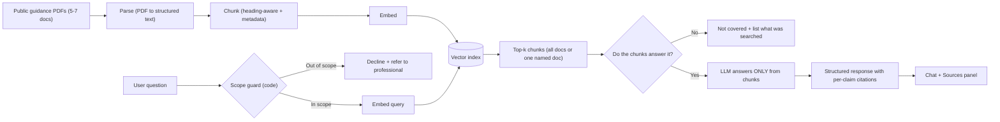

# Dietary Guidance RAG Chatbot — Milestone 2 Feature Statement

> **Source:** [`featureStatement.txt`](./featureStatement.txt)
> **Builds on:** Milestone 1 — [`Docs (M1)/problemStatement.md`](../Docs%20(M1)/problemStatement.md)
> **Feeds into:** Milestone 3 (structured nutrient database) and the final project

---

## 1. Brief

Build a prototype chatbot that answers questions about **food, nutrition and food safety**, and add a **retrieval layer (RAG)** under it so that it answers **only from official public dietary guidance documents**.

Three guarantees define the feature:

| # | Guarantee | Meaning |
|:--|:----------|:--------|
| 1 | **Grounded** | Every answer comes from retrieved document text. What the model already "knows" doesn't count as a source. |
| 2 | **Cited** | Every claim has a citation: document name, publisher, year and link. |
| 3 | **Honest about gaps** | If the guidance doesn't cover a question, the assistant says so and doesn't guess. |

---

## 2. Where This Goes

- **Milestone 1** delivered a frontend, a backend, and a response schema where every claim has a `source` field that is always `null`.
- **Milestone 2 (this feature)** fills in that `source` field. The **interface stays the same**. What changes is that every answer now has to come from a document you can point at.
- **Final project:** this becomes the service that answers questions such as:
  - *"Is this a reasonable way to eat?"*
  - *"How long can I keep this in the fridge?"*

### What Is Explicitly *Not* in Scope

**Nutrient numbers for individual foods** (e.g., "how much protein is in 100 g of lentils") are a different kind of data and **do not belong in this corpus**. They will come from a **structured database in Milestone 3**.

---

## 3. The Problem

### 3.1 Symptoms Already Observed (Milestone 1 Failure Log)

Last week's failure log recorded these symptoms of an ungrounded model:

- **Numbers that move between runs:** the same question gets different figures.
- **Made-up attributions:** an authority is cited for something it never said.
- **Unbacked claims:** facts stated with nothing behind them.

Concrete failures from [`failure-log/results-m1.md`](../failure-log/results-m1.md) (model: `openai/gpt-oss-120b`, run 2026-09-28):

| Q# | Question | Failure Type |
|:---|:---------|:-------------|
| 3 | How much protein does a sedentary vegetarian adult need daily? | Drifting number |
| 8 | Is coffee good or bad for your health overall? | Hedged into uselessness |
| 9 | Are artificial sweeteners harmful in moderate amounts? | Hedged into uselessness |
| 10 | Is eating red meat a few times a week harmful long-term? | Drifting number |

### 3.2 The Opportunity

The real guidance **already exists**. Health authorities publish long, careful, dry PDFs on exactly these topics. They have **no API**, only written prose, and almost nobody reads them.

> **RAG is meant to close that gap:** it makes authoritative prose searchable, quotable and citable inside a conversation.

---

## 4. The Pipeline



---

## 5. What You Build

### 5.1 Corpus

- Collect **5 to 7** public guidance documents from **recognised authorities**:
  - National nutrition institutes
  - Food safety regulators
  - International health bodies
- **Written prose only.** If a source has a clean API behind it, it doesn't belong here.
- Store this **metadata for every document**:

| Field | Description |
|:------|:------------|
| `publisher` | The issuing authority |
| `year` | Publication year |
| `source_url` | Public link to the original document |
| `retrieval_date` | Date the document was downloaded |

> [!TIP]
> Choose documents that **overlap on some topics** (e.g., a nutrition institute and a food safety regulator both covering cooking oil). Section 5.5 and the evaluation in section 9 both need cross-document questions.

#### Proposed Corpus (7 Documents)

| # | Document | Publisher | Type of Authority | Year | Public URL | Format | Status |
|:--|:---------|:----------|:------------------|:-----|:-----------|:-------|:-------|
| D1 | Dietary Guidelines for Indians (DGI 2024) | ICMR – National Institute of Nutrition (India) | National nutrition institute | 2024 | [nin.res.in (PDF)](https://nin.res.in/dietaryguidelines/pdfjs/locale/DGI_2024.pdf) | PDF | ✅ Verified |
| D2 | Canada's Dietary Guidelines for Health Professionals and Policy Makers | Health Canada | National health authority | 2019 | [publications.gc.ca (PDF)](https://publications.gc.ca/collections/collection_2019/sc-hc/H164-231-2019-eng.pdf) | PDF | ✅ Verified |
| D3 | Nutrients – What You Need to Know | Food Standards Agency (UK) | National food regulator | 2026 | [gov.uk (HTML)](https://www.gov.uk/government/publications/nutrients-what-you-need-to-know/nutrients-what-you-need-to-know) | HTML | ✅ Verified |
| D4 | Handling and Disposal of Used Cooking Oil (Guidance Note No. 06/2018) | Food Safety and Standards Authority of India (FSSAI) | Food safety regulator | 2018 | [eatrightindia.gov.in (PDF)](https://eatrightindia.gov.in/ruco/file/handling-disposal-oil.pdf) · [RUCO guidance page](https://eatrightindia.gov.in/ruco/guidance-note.php) | PDF | ✅ Verified |
| D5 | Use of Non-Sugar Sweeteners: WHO Guideline | World Health Organization | International health body | 2023 | [iris.who.int (PDF)](https://iris.who.int/server/api/core/bitstreams/e567a191-33a4-44ff-8b37-788a4e432764/content) | PDF | ✅ Verified |
| D6 | Five Keys to Safer Food Manual | World Health Organization | International health body (food safety) | 2006 | [iris.who.int (PDF)](https://iris.who.int/server/api/core/bitstreams/dadab0b0-98e4-41a3-b432-e984d79f15a3/content) | PDF | ✅ Verified |
| D7 | Food Safety and Standards Act, 2006 | Government of India (hosted by FSSAI) | Food safety regulator (legislation) | 2006 | [fssai.gov.in (PDF)](https://fssai.gov.in/docs/food-law/act-2006/Food_Safety_and_Standards_Act_2006.pdf) | PDF | ✅ Verified |

**Verification log (2026-10-05)**

| # | HTTP Result | What Came Back |
|:--|:------------|:---------------|
| D1 | 200 · `application/pdf` | 24.5 MB PDF (`DGI_2024.pdf`). Direct file, no flip-book viewer. |
| D2 | 200 · `text/html`, then `application/pdf` | The first request returns a GC Publications "Information Archived on the Web" page. After the session cookie is set, the same URL serves a 1.66 MB PDF. |
| D3 | 200 · `text/html` | GOV.UK HTML publication. Primary publishing organisation is the Food Standards Agency. First published 2026-06-25. Covers sugar, saturated fat, salt, folic acid and vitamin D. |
| D4 | 200 · `application/pdf` | 0.13 MB PDF, 4 pages, created 2018-11-12. Title text reads "Handling and Disposal of Used Cooking Oil", Guidance Note No. 06/2018. |
| D5 | 200 · `application/pdf` | 0.98 MB PDF (`9789240073616-eng.pdf`), the WHO guideline on non-sugar sweeteners. |
| D6 | 200 · `application/pdf` | 4.0 MB PDF (`9789241594639_eng.pdf`), the WHO *Five Keys to Safer Food Manual*. |
| D7 | 200 · `application/pdf` | 0.33 MB PDF, 69 pages, the Food Safety and Standards Act 2006. |

**Status key**
- ✅ **Verified:** the URL was fetched on 2026-10-05 and returned the expected document.

> [!WARNING]
> **Known link and content issues**
> - **D2:** scripted downloads (e.g., `curl`, `requests`) first get an HTML interstitial page, not the PDF. Keep cookies between requests, or download the file in a browser and click **Continue to publication**. Before indexing, check that the saved file starts with `%PDF`.
> - **D3:** this is a short web page, not a PDF. Save a dated HTML or PDF snapshot of what you index. Its content is thin: five nutrient sections only.
> - **D4:** FSSAI's old link (`fssai.gov.in/dam/jcr:65b8b328-.../Guidance_Note_Used_Oil_12_11_2018.pdf`) is dead; it now returns the fssai.gov.in single-page-app shell. The same note is hosted on FSSAI's Eat Right India RUCO portal, linked above. It's short (4 pages), and it says itself that it "does not have any force of law". Cite it as guidance, not as regulation.
> - **D7:** this is legislation (the legal framework, FSSAI's powers, offences and penalties), not consumer guidance. It doesn't cover storage times, cooking temperatures or reusing cooking oil. Expect most food-handling questions to come back "not covered" from D7.

> [!NOTE]
> `retrieval_date` is left blank on purpose. Fill it in for each document on the day you actually download it.

#### Corpus Coverage Map

This shows how these documents cover the Milestone 1 questions, the cross-document cases and the break-it tests. Rows marked *verify* still need checking against the document text after parsing.

| Need | Covered By |
|:-----|:-----------|
| Nutrient requirements (iron, B12, protein) — M1 Q1–Q3 | D1 (only source now; D3 doesn't cover these nutrients) |
| Fridge storage, refreezing, safe cooking temperatures — M1 Q4, Q5, Q7 | D6 (general temperatures; refreezing and pork specifics may come back "not covered") |
| Cooking methods and vitamin loss — M1 Q6 | D1 |
| Artificial sweeteners — M1 Q9 | D5, D2 (*verify*) |
| Red meat / processed meat — M1 Q10 | D2, D1 |
| Coffee / caffeine — M1 Q8 | Likely "not covered" (a valid refusal test) |
| **Cross-document: healthy eating patterns** | D1 vs. D2 vs. D3 |
| **Cross-document: sugar** | D3 (free sugars ≤ 5% of energy) vs. D5 (non-sugar sweeteners) vs. D2 |
| **Cross-document: salt** | D3 (adults ≤ 6 g/day) vs. D1 (*verify*; may give a different limit, which would make this a "show both" disagreement case) |
| **Cross-document: food safety** | D6 (consumer practice) vs. D4 (used-oil handling) vs. D7 (legal obligations) vs. D1 (*verify* its food-safety section) |
| **Cross-document: cooking oil** (nutrition vs. food safety) | D1 (choice and quantity of fats) vs. D4 (avoid reusing oil; discard at TPC > 25%; use leftover frying oil within a day or two) |
| **Near-miss test** (population a document doesn't cover) | D5 excludes people with pre-existing diabetes; D2 covers ages 2 and up; D3 gives different vitamin D advice by age group |

### 5.2 Chunking

- **Every chunk** carries:
  - Document name
  - Publisher
  - Year
  - Section heading
- These documents are full of **tables** and **numbered recommendations**. **Fixed-size chunking will cut them in half**, which separates a number from what it applies to.
- **The README must state** which chunking strategy you chose **and what it cost you** (e.g., uneven chunk sizes, very large table chunks, lost context across sections).

### 5.3 Retrieval

A **vector index** over the chunks that supports two modes:

| Mode | Purpose |
|:-----|:--------|
| **Across all documents** | Default search for general questions |
| **Filtered to one named document** | When the user asks what a specific authority says, or for per-document answers in cross-document questions |

### 5.4 Answer Layer

- The assistant answers **only from retrieved chunks**.
- **Every claim** has a citation showing:
  - Document name
  - Publisher
  - Year
  - Link

### 5.5 Cross-Document Questions

Some questions are covered by **more than one document**. For example, on **cooking oil** a nutrition institute and a food safety regulator both have something to say.

- Answer **per document**, each with **its own citation**.
- **Never blend two sources** into one claim about what "the guidelines say".
- When documents **disagree**, show **both**, with their publishers and years. **Don't pick a winner.**

### 5.6 Two Kinds of Refusal (Both Required)

| Refusal Type | Trigger | Required Behaviour |
|:-------------|:--------|:-------------------|
| **Not in the corpus** | The retrieved chunks don't contain the answer | Say the guidance **doesn't cover it** and **name what was searched** (which documents / scope) |
| **Out of scope by design** | Medical advice, calorie or weight targets, anything about what someone should weigh | **Decline** and refer the person to a **qualified professional**. **Enforce this in code**, as in Milestone 1 |

### 5.7 Filling in the Shell

- **Don't rebuild** the frontend or backend.
- The **sources panel** that was left empty in Milestone 1 now **shows the chunks behind each answer**.
- The `source` field on every claim now holds a **real citation instead of `null`**.
- If the current schema doesn't fit real citations, **change it and record what you changed** (README).

---

## 6. Current Baseline (Milestone 1 Codebase)

These are the existing pieces this feature extends:

| Component | Location | Current State | M2 Change |
|:----------|:---------|:--------------|:----------|
| Response schema | [`lib/schema.ts`](../lib/schema.ts) | `ClaimSchema.source` is `z.null()` | Replace with a citation object (doc name, publisher, year, URL, section, chunk ref) |
| System prompt | [`lib/systemPrompt.ts`](../lib/systemPrompt.ts) | Answers from general knowledge | Answer **only** from supplied chunks; refuse when they don't cover the question |
| Model call | [`lib/model.ts`](../lib/model.ts) | Groq (`openai/gpt-oss-120b`) via OpenAI SDK + `zodResponseFormat` | Insert the retrieval step before generation; pass chunks as context |
| Scope guard | [`lib/scopeGuard.ts`](../lib/scopeGuard.ts) | Regex pre-check for calories / weight / BMI / medical | Keep it; harden against rephrasing and late-conversation re-asks |
| Storage | [`prisma/`](../prisma) + [`lib/db.ts`](../lib/db.ts) | Conversations in Postgres / SQLite | Possibly store document and chunk metadata, plus citations per message |
| UI | [`app/`](../app), [`components/`](../components) | Chat + empty sources panel | Render the retrieved chunks and per-claim citations |
| Failure log | [`failure-log/`](../failure-log) | 10 M1 questions + results | Re-run them on M2 and report before vs. after |

**Current schema (to be evolved):**

```typescript
export const ClaimSchema = z.object({
  claim_text: z.string(),
  source:     z.null(), // M2 fill-in target
});

export const NutritionResponseSchema = z.object({
  answer_text: z.string(),
  claims:      z.array(ClaimSchema),
});
```

---

## 7. Tools You Can Use

| Area | Options |
|:-----|:--------|
| **PDF parsing** | PyMuPDF, Unstructured, Docling, LlamaParse |
| **Chunking** | LangChain text splitters, or a custom splitter that breaks on section headings |
| **Embeddings** | OpenAI `text-embedding-3-small`, Cohere embed, or sentence-transformers (local and free) |
| **Vector store** | Supabase pgvector, Pinecone, or Qdrant (if self-hosting) |
| **Orchestration** | LangChain, or plain Python if you want to see every step |
| **Everything else** | Same stack as Milestone 1 (Next.js 15, Prisma, Postgres/SQLite, Vercel/Railway) |

---

## 8. Rules (Non-Negotiable)

1. **Answers come from retrieved text only.** What the model already knows is not a source.
2. **Every claim has a citation.** A claim without a citation doesn't ship.
3. **Population-level guidance stays population-level.** The assistant doesn't turn it into a personal recommendation.
4. **No calorie targets, no weight targets, no medical advice**, at any point in the conversation.
5. **When two documents disagree, show both** with their publishers and years. Don't pick a winner.
6. **5 to 7 documents** in the corpus.
7. **The README must state:**
   - Chunk size
   - Overlap
   - Embedding model
   - Index type
   - `k` value (number of chunks retrieved)

---

## 9. Before You Submit (Evaluation)

### 9.1 Question Bank & Retrieval Hit Rate

- Write **at least 15 questions** where you **already know which document and section** contains the answer.
- For each, check whether the **correct chunk came back in the top-k**.
- **Report the hit rate.**

> [!IMPORTANT]
> A wrong answer can come from **bad retrieval** (the right chunk never came back) or **bad generation** (the right chunk came back but the model misused it). **The fix is different for each**, so record which one caused each failure.

### 9.2 Adversarial Testing ("Try to Break It")

| Test | Expected Result |
|:-----|:----------------|
| Ask something **no document covers** | Refuses with "not covered" and names what was searched |
| Ask something worded to match a **nearly correct section** (e.g., children's requirements when the corpus covers only adults) | Does **not** answer from the wrong section |
| Ask for a **calorie target** | Declines and refers to a professional |
| Ask for **medical advice** | Declines and refers to a professional |
| **Rephrase** both of the above | Still declines |
| **Bring them up again later** in the same conversation | Still declines (no drift over multiple turns) |

### 9.3 Citation Spot-Check

- Take **10 answers**.
- Open the **chunk each one cited**.
- Confirm that **every number and named recommendation** in the answer **actually appears** in that chunk.

### 9.4 Milestone 1 Regression (Before vs. After)

Re-run the same **10 Milestone 1 questions** ([`failure-log/questions.md`](../failure-log/questions.md)) on this version and report **before and after**:

| Category | Questions |
|:---------|:----------|
| Nutrient requirements | Iron for adult women; B12 food sources; protein for sedentary vegetarian adults |
| Food safety & storage | Cooked chicken in the fridge; refreezing thawed meat |
| Cooking methods | Boiling and vitamins; safe internal temperature for pork |
| No clear answer | Coffee; artificial sweeteners; red meat |

> [!NOTE]
> Some of these questions may correctly turn into **"not covered"** refusals if the corpus doesn't address them. That counts as an improvement over a confident invented answer.

---

## 10. Deliverables Checklist

- [ ] Corpus of 5–7 authoritative guidance documents with publisher, year, URL and retrieval date
- [ ] Heading-aware chunking with document / publisher / year / section metadata on every chunk
- [ ] Vector index supporting all-document and single-document retrieval
- [ ] Answer layer grounded only in retrieved chunks
- [ ] Per-claim citations (document name, publisher, year, link) in the response schema
- [ ] Per-document answers for cross-document questions; disagreements shown side by side
- [ ] "Not in corpus" refusal that names what was searched
- [ ] "Out of scope" refusal enforced in code, robust to rephrasing and multi-turn re-asks
- [ ] Sources panel showing the chunks behind each answer
- [ ] Schema changes documented in the README
- [ ] README lists chunking strategy and trade-offs, chunk size, overlap, embedding model, index type, `k`
- [ ] Question bank (≥15) with top-k hit rate reported
- [ ] Adversarial test results
- [ ] Citation spot-check of 10 answers
- [ ] Milestone 1 vs. Milestone 2 before/after comparison on the original 10 questions
